# ServiceNow ITSM Change Management Lab

## End-to-End Change Request, CAB Approval, Implementation, Testing, and Reporting

This project demonstrates hands-on experience using ServiceNow IT
Service Management (ITSM) to manage a production infrastructure change
through the full change lifecycle.

The scenario involved upgrading production Windows servers to Windows
Server 2025. The change was documented, assessed, submitted for
approval, scheduled, implemented, validated, reviewed, and successfully
closed. The project also includes an operational incident report created
in ServiceNow.

------------------------------------------------------------------------

## What This Lab Demonstrates

This lab demonstrates practical experience with:

-   ServiceNow IT Service Management (ITSM)
-   Normal Change management
-   Change request creation and documentation
-   Risk and business impact assessment
-   Implementation, test, and backout planning
-   Change Advisory Board (CAB) approval workflows
-   Change scheduling and maintenance windows
-   Change task management
-   Post-implementation testing
-   Change review and closure
-   Incident reporting and operational analytics
-   ITIL-aligned change management practices

------------------------------------------------------------------------

## Business Scenario

An organization needs to upgrade its production Windows servers to
Windows Server 2025 to maintain vendor support, apply current security
updates, and improve system performance and reliability.

Because the upgrade affects production infrastructure, the work must be
managed through a formal change management process. The change requires
documented business justification, risk analysis, implementation
planning, testing procedures, a backout strategy, CAB approval, a
defined maintenance window, post-change validation, and formal closure.

The objective of this lab was to manage that process in ServiceNow while
maintaining a clear record of approvals, implementation activities,
testing, and final results.

------------------------------------------------------------------------

## Technologies and Concepts

  -----------------------------------------------------------------------
  Technology / Concept                Use in Project
  ----------------------------------- -----------------------------------
  ServiceNow                          ITSM platform used to manage the
                                      change lifecycle

  Change Management                   Managed the production server
                                      upgrade from request through
                                      closure

  CAB                                 Reviewed and approved the proposed
                                      production change

  Change Tasks                        Tracked implementation and
                                      post-implementation testing

  Incident Management                 Source data for operational
                                      reporting

  ServiceNow Reporting                Created an incident-volume report

  ITIL Practices                      Applied structured change control
                                      and validation practices
  -----------------------------------------------------------------------

------------------------------------------------------------------------

## Change Management Workflow

``` text
Change Request
      ↓
Assessment
      ↓
Risk / Impact Analysis
      ↓
Implementation, Test & Backout Planning
      ↓
CAB Approval
      ↓
Authorization
      ↓
Scheduled Maintenance Window
      ↓
Implementation
      ↓
Post-Implementation Testing
      ↓
Review
      ↓
Successful Closure
      ↓
Operational Reporting
```

------------------------------------------------------------------------

## 1. Create the Change Request

A Normal Change was created for the production Windows Server 2025
upgrade.

### Change Details

  -----------------------------------------------------------------------
  Field                               Value
  ----------------------------------- -----------------------------------
  Change Type                         Normal

  Category                            Software

  Short Description                   Upgrade all production servers to
                                      Windows Server 2025

  Impact                              1 - High

  Risk                                Moderate

  Assignment Group                    Change Management

  Assigned To                         Change Manager
  -----------------------------------------------------------------------

The change description documented the reason for the upgrade, including
vendor support, current security updates, system performance, and
reliability.

### Screenshot

Add the initial change request screenshot here.

``` markdown
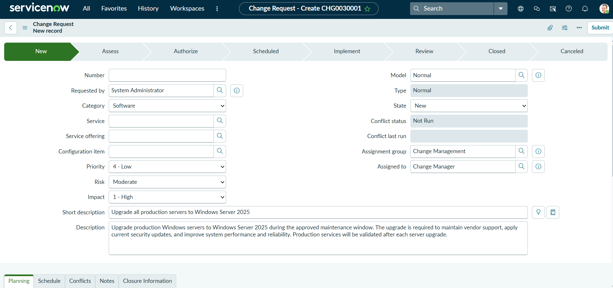
```

------------------------------------------------------------------------

## 2. Document Change Planning

The Planning section was used to document the business justification,
risk analysis, implementation plan, backout plan, and test plan.

### Business Justification

Windows Server 2025 provides current vendor support, security
enhancements, and improved system reliability. The upgrade reduces
exposure associated with outdated operating systems and supports
organizational patching and support standards.

### Risk Analysis

The change affects production infrastructure, creating potential
business impact if an upgrade fails. Risk was reduced by using an
approved maintenance window, upgrading systems in a controlled manner,
validating each server, and maintaining a recovery strategy.

### Backout Plan

If an upgrade fails or critical applications do not function correctly:

1.  Stop further deployment.
2.  Restore the affected server using the verified pre-change backup or
    system snapshot.
3.  Confirm services and applications return to their previous working
    state.
4.  Notify the Change Management team.

### Test Plan

Following each upgrade:

1.  Verify that the server boots successfully.
2.  Confirm network connectivity.
3.  Validate critical Windows services.
4.  Validate production applications.
5.  Confirm users can access required services.
6.  Review system and application event logs.
7.  Monitor server performance before continuing.

### Screenshot

``` markdown
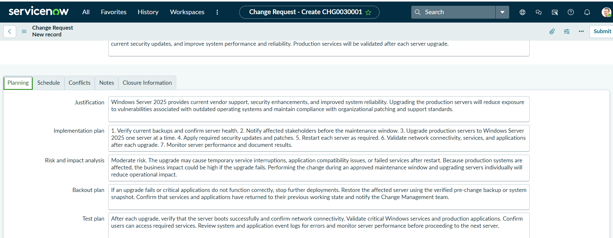
```

------------------------------------------------------------------------

## 3. Schedule the Change

The production upgrade was assigned a defined maintenance window.

  Schedule Item     Date / Time
  ----------------- ------------------
  Planned Start     2026-08-29 22:00
  Planned End       2026-08-30 02:00
  CAB Required      Yes
  CAB Date / Time   2026-08-28 14:00

Establishing a maintenance window provides a controlled period for
implementation and helps reduce disruption to production services.

### Screenshot

``` markdown
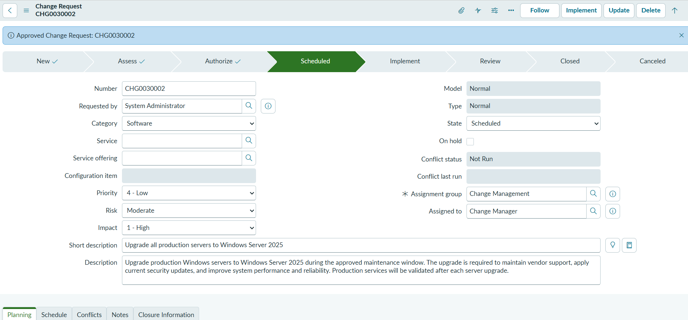
```

------------------------------------------------------------------------

## 4. Manage the CAB Approval Workflow

Because the production upgrade was configured to require CAB review, the
change entered the approval process before implementation.

The approval workflow demonstrated:

-   Change Manager review
-   CAB approval requests
-   Multiple CAB approvers
-   Approval status tracking
-   Authorization before scheduling and implementation

The CAB recommendation included reviewing the upgrade scope,
implementation plan, business impact, testing procedures, and backout
strategy before implementation.

After the required approvals were received, ServiceNow progressed the
change through authorization and into the Scheduled state.

### Screenshots

``` markdown
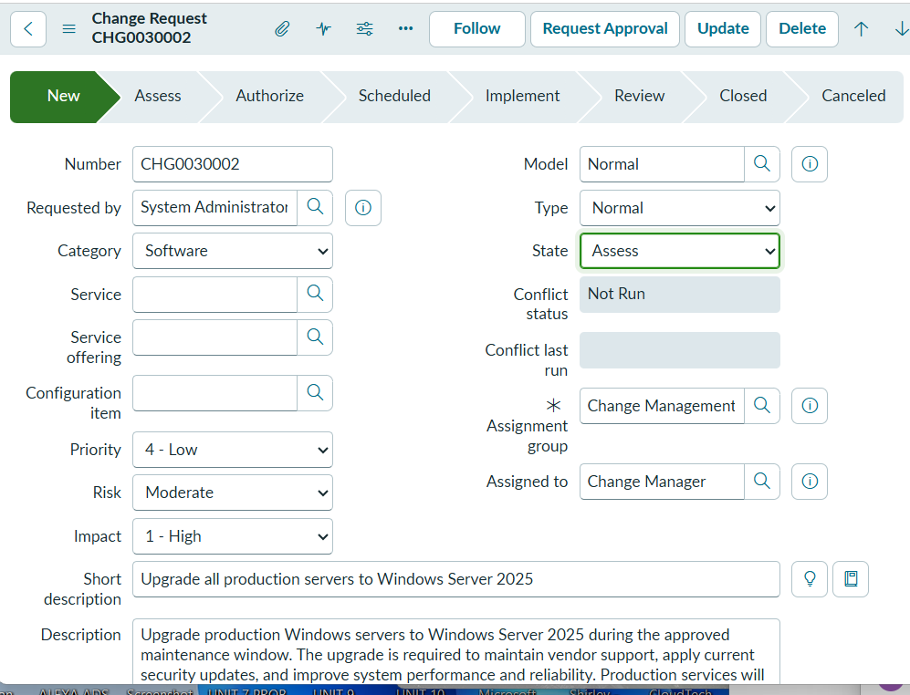

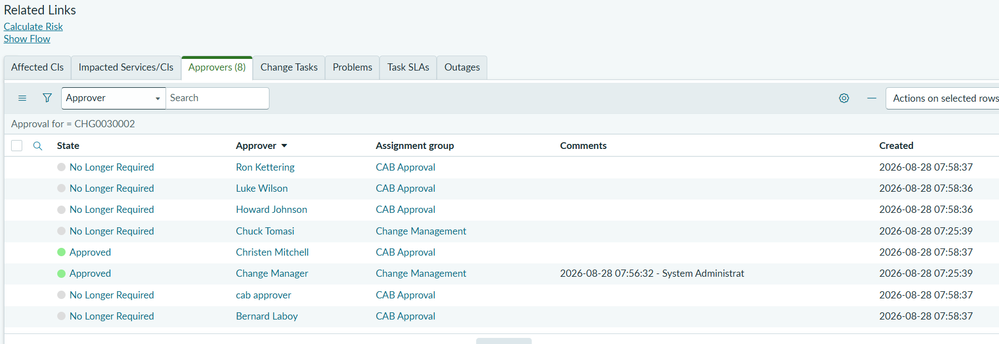

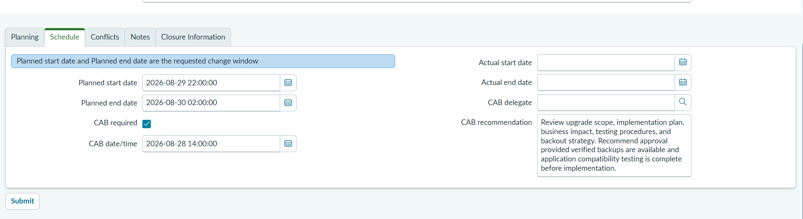
```

------------------------------------------------------------------------

## 5. Implement the Change

After approval and scheduling, the change moved into the Implement
phase.

ServiceNow generated change tasks to separate the implementation work
from post-implementation validation.

### Implementation Task

The implementation task represented execution of the Windows Server 2025
production upgrade.

The task was tracked independently and closed after the planned
implementation activities were completed.

``` markdown
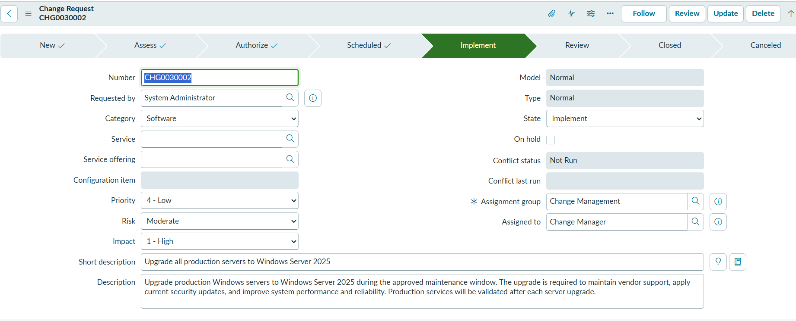
```

------------------------------------------------------------------------

## 6. Perform Post-Implementation Testing

A separate Testing change task was used for post-implementation
validation.

Testing verified that the upgraded environment was functioning as
expected before the parent change progressed to final review.

Validation included:

-   Server availability
-   Network connectivity
-   Windows services
-   Production application availability
-   User access
-   Event log review
-   Server performance

Both the Implementation and Post Implementation Testing tasks were
successfully closed.

``` markdown
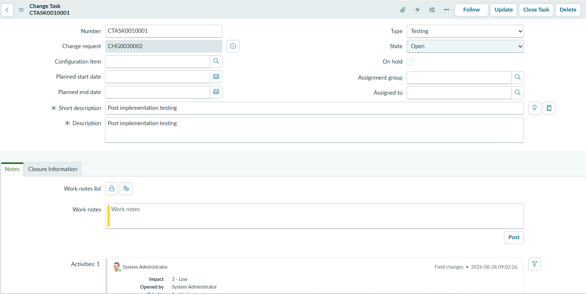
```

------------------------------------------------------------------------

## 7. Review and Close the Change

After implementation and testing were completed, the change progressed
to Review.

The ServiceNow record captured the actual implementation timestamps and
showed that both associated change tasks were closed.

The change was then formally closed with a close code of `Successful`.

### Close Notes

> Windows Server 2025 production server upgrade completed successfully.
> All planned implementation activities were completed and
> post-implementation testing confirmed server availability, network
> connectivity, Windows services, and production applications were
> functioning as expected. No critical issues were identified during
> validation. The change was completed without requiring the backout
> plan.

``` markdown
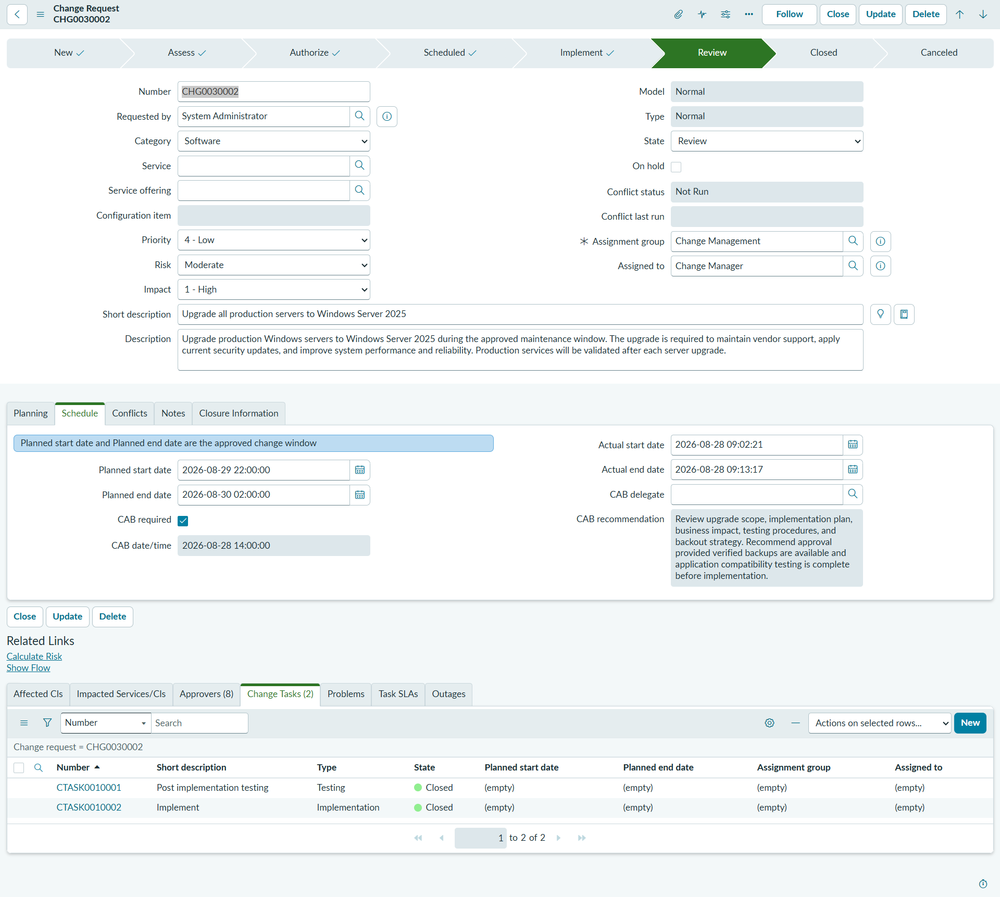

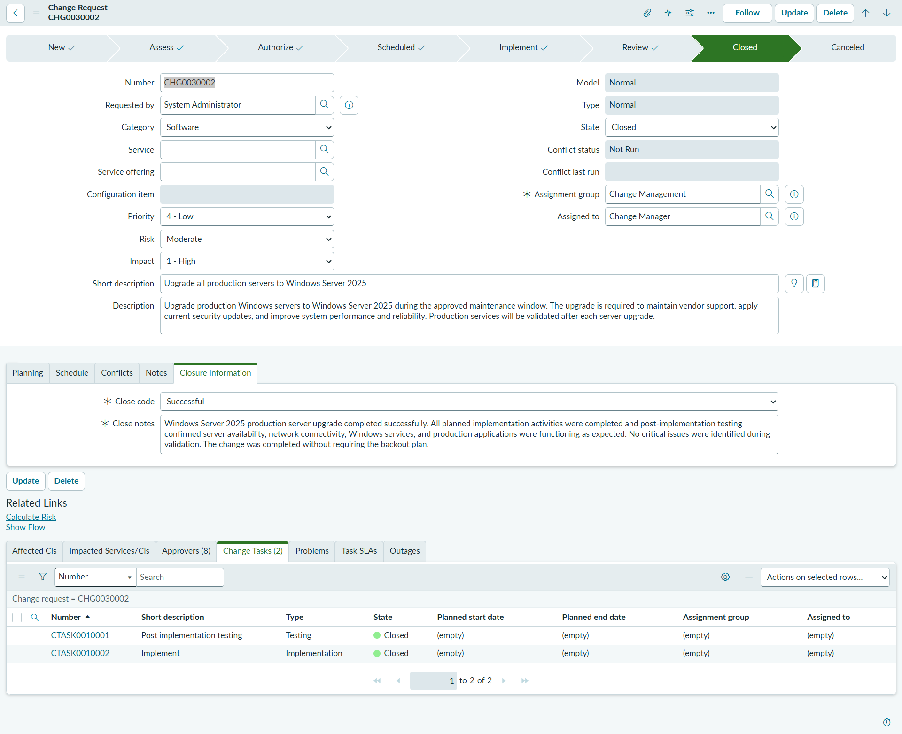
```

------------------------------------------------------------------------

## 8. Build an Operational Report

After completing the change management workflow, a ServiceNow report was
created to analyze recent incident activity.

### Report Configuration

  Setting              Configuration
  -------------------- ----------------------------------------------
  Report Name          Incident Volume by Priority --- Last 30 Days
  Table                Incident
  Visualization        Bar chart
  Filter               Created on Last 30 days
  Group By             Priority
  Aggregation          Count
  Display Data Table   Enabled

### Report Results

The report returned six incidents during the reporting period.

All six incidents were classified as:

-   Priority 4 - Low
-   Incident Count: 6
-   Percentage of Count: 100%

The report demonstrates how ServiceNow operational data can be filtered,
grouped, aggregated, and visualized to support IT service management
reporting.

``` markdown
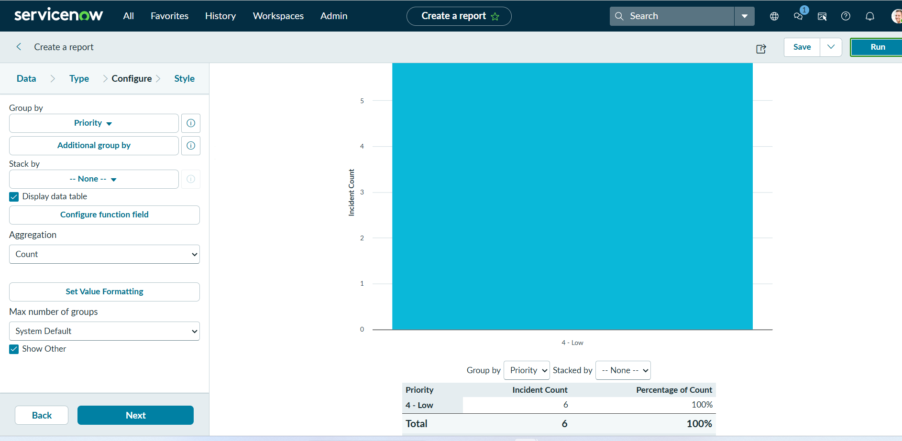
```

### Exported Report

The completed ServiceNow report was also exported to PDF to demonstrate
report distribution and documentation.

``` markdown
[View the Incident Volume by Priority Report](reports/incident-volume-by-priority-last-30-days.pdf)
```

------------------------------------------------------------------------

## Final Results

The production upgrade scenario was successfully managed through the
complete ServiceNow change lifecycle:

-   Normal Change created
-   Business justification documented
-   Risk and impact evaluated
-   Implementation plan documented
-   Backout strategy documented
-   Test plan established
-   Maintenance window scheduled
-   CAB approval workflow completed
-   Change authorized
-   Implementation task completed
-   Post-implementation testing completed
-   Change reviewed
-   Change closed successfully
-   Operational incident report created and exported

------------------------------------------------------------------------

## Skills Demonstrated

### ServiceNow Administration

-   Navigating ServiceNow ITSM records
-   Creating and managing change requests
-   Managing related records and change tasks
-   Working with approval records
-   Building and exporting reports

### IT Service Management

-   Change lifecycle management
-   CAB governance
-   Risk assessment
-   Business impact analysis
-   Maintenance-window planning
-   Implementation planning
-   Backout planning
-   Post-change validation
-   Change closure

### Operational Reporting

-   Incident data analysis
-   Date-based filtering
-   Priority grouping
-   Count aggregation
-   Bar-chart visualization
-   Report export and stakeholder-ready documentation

------------------------------------------------------------------------

## Key Takeaways

This lab provided hands-on experience with more than simply creating a
ServiceNow ticket. It required managing a production-change scenario
through governance, approval, implementation, testing, review, and
closure.

The project also reinforced the relationship between technical execution
and change control. A production change requires clear documentation,
defined ownership, risk mitigation, approval checkpoints, validation
criteria, and an auditable record of the final outcome.

Adding operational reporting extended the lab beyond the individual
change record by demonstrating how ServiceNow data can be used to
provide visibility into broader IT service activity.

------------------------------------------------------------------------

## Repository Structure

``` text
ServiceNow-ITSM-Change-Management-Lab/
│
├── README.md
│
├── reports/
│   └── incident-volume-by-priority-last-30-days.pdf
│
└── screenshots/
    ├── 01-change-request.png
    ├── 02-change-planning.png
    ├── 03-change-schedule.png
    ├── 04-approval-request.png
    ├── 05-cab-approvals.png
    ├── 06-change-scheduled.png
    ├── 07-implementation-task.png
    ├── 08-testing-task.png
    ├── 09-change-review.png
    ├── 10-change-closed.png
    └── 11-incident-report.png
```

------------------------------------------------------------------------

## Project Status

Completed

The ServiceNow change request progressed successfully from New through
Assess, Authorize, Scheduled, Implement, Review, and Closed.
